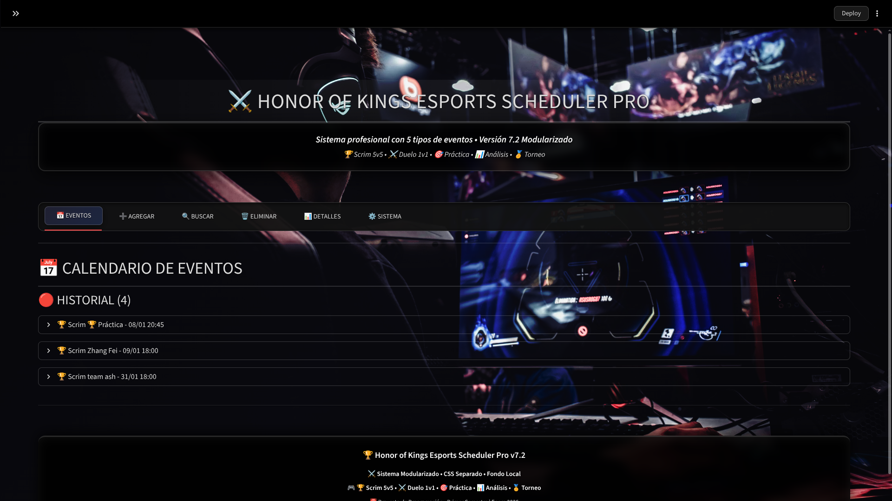
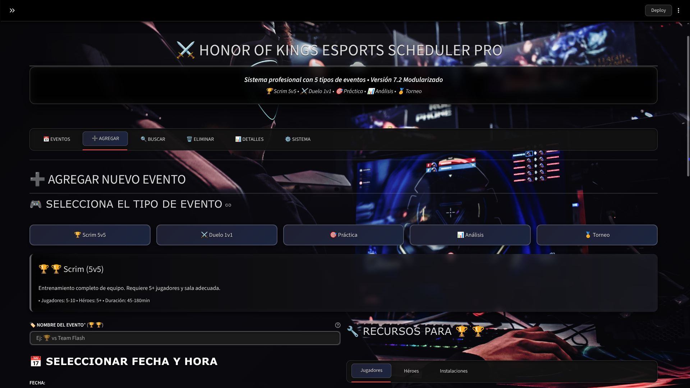
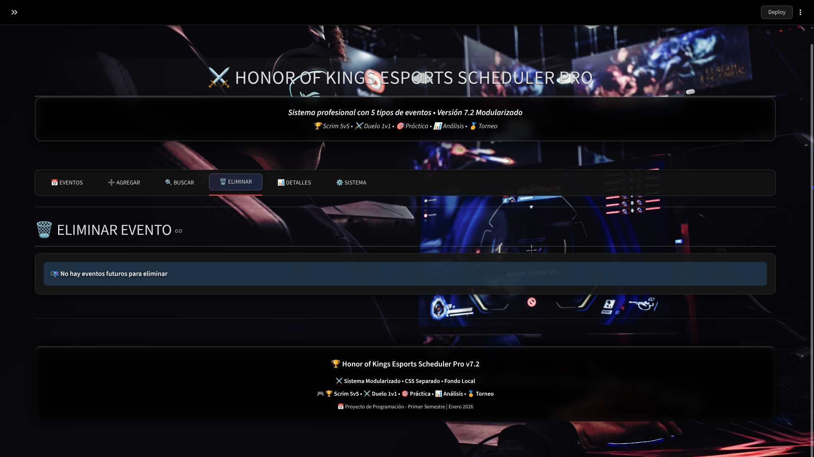
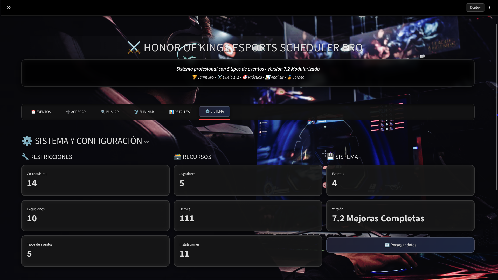
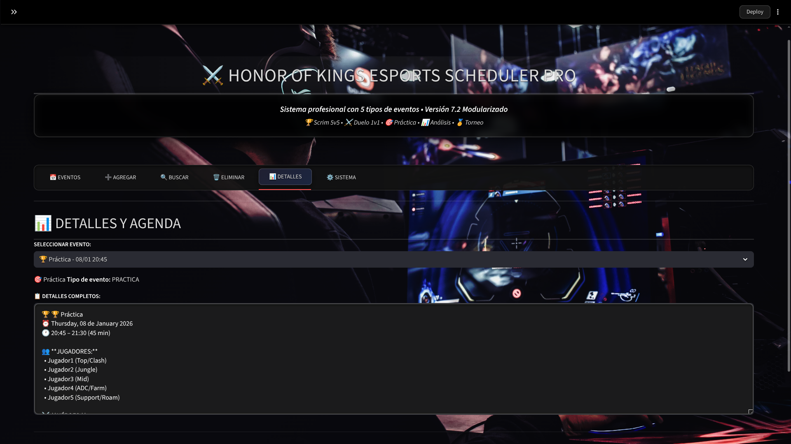

# 🏆 Honor of Kings Esports Scheduler Pro

## 📋 Dominio Elegido: Gestión de Equipos Profesionales de eSports

**Por qué este dominio:** Elegí Honor of Kings porque es el MOBA móvil más jugado del mundo, con una escena eSports vibrante (torneos con premios millonarios). Me permite modelar restricciones reales como compatibilidad de héroes con jugadores y exclusiones por roles, inspirado en drafts competitivos. Es un dominio dinámico que combina estrategia, tiempo y recursos, ideal para el proyecto.

**Contexto:** Sistema de gestión integral para equipos competitivos de Honor of Kings (王者荣耀). Gestiona scrims, prácticas, análisis de draft y asignación de recursos profesionales.

---

## 🎯 Características Implementadas

### ✅ **Requisitos Mínimos del Proyecto (COMPLETOS)**

#### 1. **Eventos y Recursos**

- **Eventos:** Scrims profesionales, análisis de draft, prácticas específicas
- **Recursos organizados en 3 categorías:**
  - **👥 Jugadores:** 5 jugadores con roles específicos
  - **⚔️ Héroes:** ~30 héroes organizados por rol (Assassin, Fighter, Mage, etc.), corregidos para precisión con la versión oficial.
  - **🏢 Instalaciones:** Salas de práctica, dispositivos, coach

#### 2. **Restricciones Personalizadas (REQUERIDO)**

Implementadas **EXACTAMENTE** como se solicita en el proyecto. Ejemplos:

##### 🔗 **Restricciones de Co-requisito (Inclusión):**

- `Héroe: Lam` → `Jugador2 (Jungle)` (Lam requiere jungla específica). Ej: En un scrim, si usas Lam, debes incluir Jugador2 para maximizar sinergia.
- `Héroe: Ao Yin` → `Jugador4 (ADC/Farm)` (Ao Yin requiere ADC específico). Ej: Ao Yin es un marksman dragón que necesita un jugador farm-heavy.
- `Coach Principal` → `Dispositivo Android Pro`. Ej: El coach necesita hardware pro para análisis en vivo.
- `Héroe: Daji` → `Jugador3 (Mid)`.
- `Sala de Práctica 1` → `Dispositivo Android Pro`.

##### ⚡ **Restricciones de Exclusión Mutua:**

- `Lam` ≠ `Li Bai` (no pueden jugar juntos, mismo rol premium). Ej: Ambos assassins premium compiten por jungle resources.
- `Daji` ≠ `Kongming` (mages mid conflictivos). Ej: Sus kits de control se solapan, reduciendo efectividad.
- `Sala 1` ≠ `Android Elite` (incompatibilidad técnica).

#### 3. **Validación Automática de Conflictos**

- ✅ Verificación de superposición temporal
- ✅ Detección de recursos duplicados
- ✅ Validación de formato de fechas
- ✅ Prevención de eventos en el pasado

#### 4. **Búsqueda Inteligente de Huecos**

- 🔍 Algoritmo optimizado que busca cada 30 minutos
- ⏱️ Límite configurable (hasta 7 días)
- 🕐 Considera solo horario laboral (9:00 - 22:00)
- ✅ Respeta todas las restricciones y conflictos

#### 5. **Operaciones CRUD Completas**

- ➕ Crear eventos con validación completa
- 📖 Listar eventos (futuros/pasados separados)
- 🗑️ Eliminar eventos con confirmación
- 📊 Ver detalles detallados

#### 6. **Persistencia de Datos**

- 💾 Guardado automático en `data.json`
- 🔄 Carga inicial con datos de ejemplo
- 📁 Formato JSON estructurado y legible
- ⏰ Timestamp de última actualización

#### 7. **Interfaz de Usuario Profesional**

- 🎨 Tema oscuro con acentos dorados
- 📱 Diseño responsive con tabs
- 🎯 Validaciones en tiempo real
- 📊 Estadísticas y métricas

---

## 🚀 Instalación y Ejecución

### **Requisitos Previos**

- Python 3.8 o superior
- pip (gestor de paquetes de Python)

### **Pasos de Instalación**

1. **Clonar/Descargar los archivos:**
   - Copia los archivos en una carpeta local.
2. **Instalar dependencias:**

## 📸 Capturas de Pantalla

Interfaz profesional en tema oscuro con acentos dorados y diseño responsive.

**Dashboard Principal y navegación por tabs**  

**Formulario completo para crear un evento**  

**Sección Eliminar Evento (estado vacío)**  

**Dashboard de Sistema y Configuración (v7.2)**  
Muestra conteo de restricciones, recursos, héroes (111), eventos y botón de recarga.  

**Ejemplo de Detalles de Evento**  

